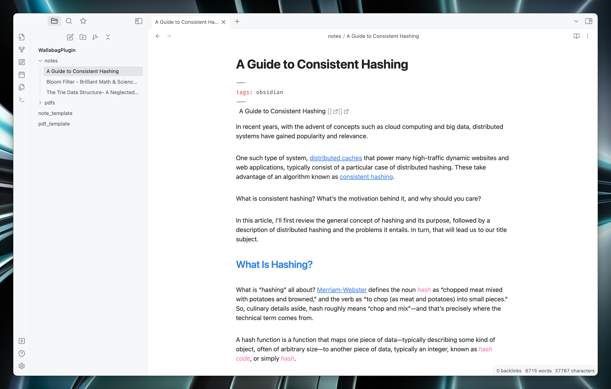

# Obsidian Wallabag Plugin

**Notice: Right now I have no intention to publish this to the Obsidian plugin galery because I don't see a demand; however if you found this via web search and have any question feel free to open an issue!**

This plugin for [Obsidian](https://obsidian.md) allows you to sync [Wallabag](https://www.wallabag.it/en) items into Obsidian notes in various ways.

## Authentication

After installing and enabling the plugin first you need to authenticate yourself with your Wallabag instance.
You can follow the Wallabag's [iOS Setup guide](https://doc.wallabag.org/en/apps/ios.html) for obtaining the client attributes.

## Usage

This plugin fulfills a qiute straightforward purpose; it syncs Wallabag articles and creates notes from them in various possible formats.

Use the command "Sync Wallabag Articles" to sync new articles. Plugin will keep a track of items synced so if you delete a created note, it won't be generated again unless you use the command "Clear synced articles cache" to reset the plugin cache.

There are various settings under the plugin settings you can use to personalize your workflow, here are some important ones:

| Setting  |  Decsription |
|:--|:--|
|Tag to sync | Use this for syncing only the articles tagged with tag. If empty plugin will sync all the articles.  |
|Article Notes Folder | Define the folder you want synced notes will be created. If empty notes will be created at the vault root.   |
|Article Note Template  | Use to pass a custom template for notes. See the [Templating](#templating) for more details.  |
| Export as PDF | If enabled synced articles will be exported as PDFs.|


## Templating

By default this plugin offers two builtin templates; one for inserting the content of the article as a note and one for creating a note with a link to the exported PDF, when the option is enabled. Both the templates include link to the original articles, a link to the Wallabag item and tags. See the example below:



You can use a custom template, in that case plugin will pass the following variables.
| Variable        | Description                                                                                                        |
|:----------------|:-------------------------------------------------------------------------------------------------------------------|
| `article_title` | Title of the article                                                                                               |
| `original_link` | Link to the source article                                                                                         |
| `wallabag_link` | Link to the article in Wallabag                                                                                    |
| `content`       | HTML content extracted by wallabag                                                                                 |
| `pdf_link`      | An Obsidian wikilink to the exported pdf file. <sub><br> Only populated if the PDF export option is choosen.</sub> |
| `tags`          | Comma separated list of tags attached to the Wallabag article                                                      |

I mainly use the template to export pdfs and use [Annotator]() to read using the following template.

```
---
annotation-target: {{pdf_link}}
---
```


## Installation

### Manually

- You need Obsidian v1.0.0+ for latest version of plugin
- Get the [Latest release of the plugin](https://github.com/huseyz/obsidian-wallabag/releases/latest) 
- Extract the files in your vault's plugins folder: `[VAULT]/.obsidian/plugins/`
- Reload Obsidian
- Make sure Safe Mode is off and the plugins is enabled.
